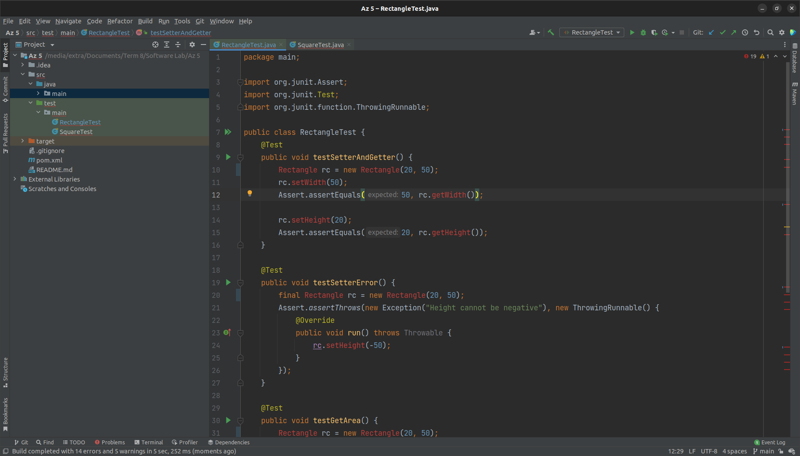
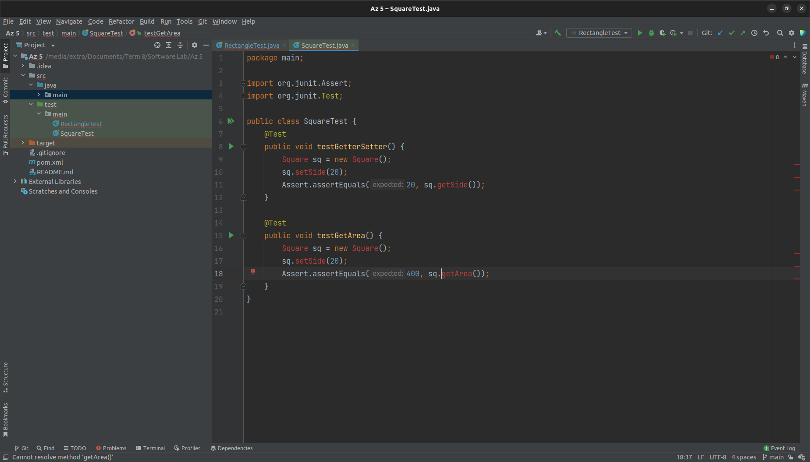
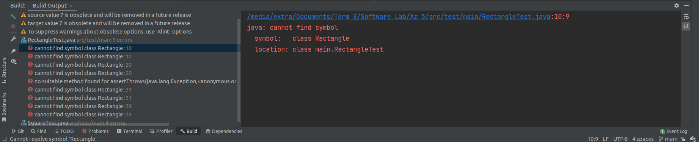
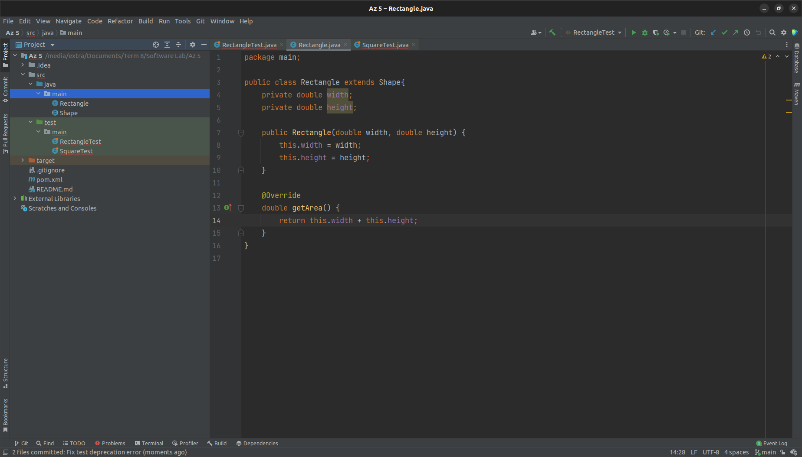
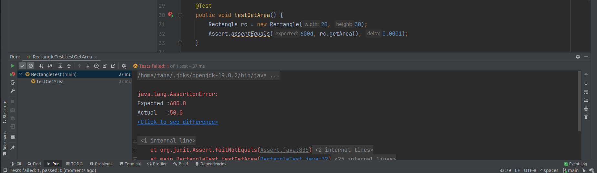
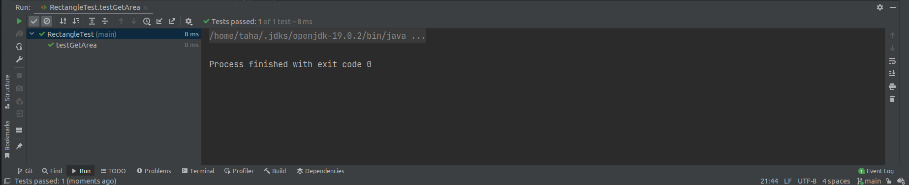
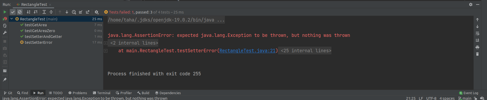
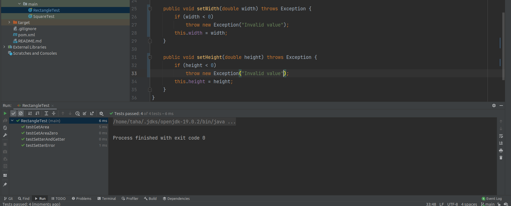
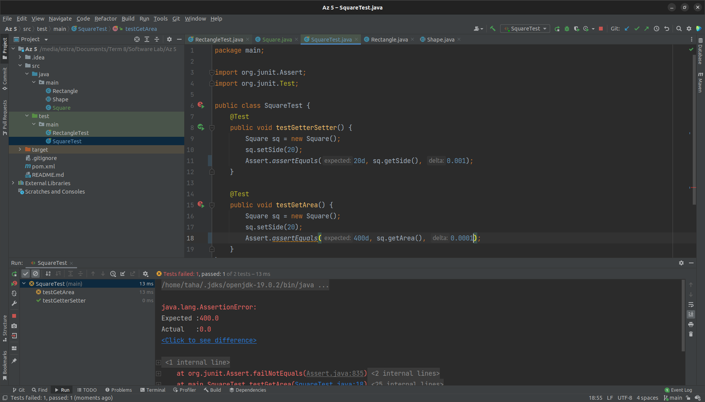
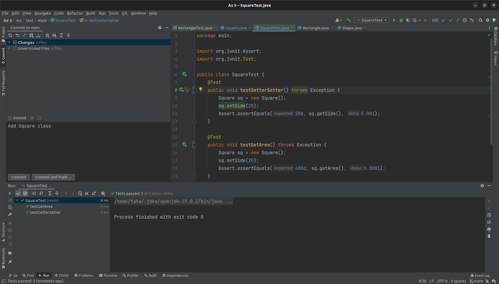

# software-engineering-lab-session5

  | `Person Number` | `First Name` | `Last Name` | `Student Number` |
  |:---------------:|:------------:|:-----------:|:----------------:|
  | `First Person` | Moahmmad Taha | Jahani-Nezhad | 98101363  |
  | `Second Person` | Iman | Alipour | 98102024 |
  
---
# مراحل انجام آزمایش

در این آزمایش می‌خواهیم TDD را انجام دهیم. بنابراین طبق دستورکار، ابتدا باید نیازمندی‌های پروژه را در قالب تست‌هایی بنویسیم.

برای استخراج نیازمندی‌ها، مراحل انجام آزمایش را به دقت مطالعه می‌کنیم و تلاش می‌کنیم تمامی خواسته‌های این آزمایش را به ترتیب بنویسیم:

- یک کلاس مستطیل داریم که می‌توان با یک طول و عرض مشخص آن‌را تعریف کرد.
- هر شی مستطیل باید قابلیتی محاسبه‌ی مساحت خود را داشته باشد.
- می‌خواهیم امکان تغییر ابعاد مستطیل را داشته باشیم.
- یک کلاس مربع داریم که می‌توان آن‌را با مشخص کردن اندازه‌ی ضلع تعریف کرد.
- هر شی مربع باید قابلیت محاسبه‌ی مساحت خود را داشته باشد.
- می‌خواهیم امکان تغییر اندازه‌ی ضلع یک مربع را داشته باشیم.

با توجه به این نیازمندی‌ها، تست‌های جداگانه‌ای را برای کلاس‌های مربع و مستطیل می‌نویسیم. این کلاس‌ها در آدرس `/src/test/main` قرار دارند. در دو تصویر زیر، قطعه کدهای مربوط به تست‌های این دو کلاس را می‌توانید مشاهده کنید:





همانطور که مشاهده می‌شود، هر دو کلاس ارور های کامپایل دارند؛ دلیل آن هم این است که هیچ کلاس و نه هیچ Interfaceیی به نام‌های Square و Rectangle تعریف نشده است. طبق خواسته‌ی دستور کار، تست‌ها را اجرا می‌کنیم تا ایرادات زمان کامپایل آن‌ها را متوجه شویم. پس از اجرای تست‌های مربوط به مستطیل، پیام زیر نمایش داده می‌شود:



با توجه به خطای فوق، متوجه می‌شویم که باید کلاس Rectangle را تعری کنیم. طبق اصول SOLID که با آن‌ها در ابتدای این آزمایش آشنا شده‌ایم، ساختار درختی زیر را برای طراحی کلاس‌ها استفاده می‌کنیم:
```markdown
Shape
|___ Rectangle
|___ Square
```
بنابراین برای شروع ابتدا کلاس Shape را تعریف می‌کنیم. از آنجایی که خود Shape یک مفهوم مجزا نیست و نباید امکان ساختن اشیا از روی آن وجود داشته باشد، آن‌را به صورت کلاس _abstract_ تعریف می‌کنیم و داخل آن تنها تابع _getArea()_ را قرار می‌دهیم:
```java
public abstract class Shape {
    abstract double getArea();
}
```
اکنون کلاس مستطیل را تعریف می‌کنیم. طبق خواسته‌ی دستورکار، ابتدا این کلاس را طوری تعریف می‌کنیم که امکان تغییر طول و عرض در آن وجود نداشته باشد و تنها بتوان هنگام ساختن شی طول و عرض آن‌را مشخص کرد. تصویری از تعریف ابتدایی این کلاس در زیر آمده است:

_دقت کنید که به طور عامدانه اشتباهی در تعریف تابع `getArea()` قرار دارد تا تست‌ها دچار خطای زمان اجرا نیز بشوند_

اکنون دوباره تست‌ها را اجرا می‌کنیم. این بار، تست‌هایی که نیازی به کلاس Square و یا توابع Getter و Setter در کلاس مستطیل ندارند، خطای کامپایل دریافت نمی‌کنند. در نتیجه انتظار داریم که تست `testGetArea()` به درستی اجرا و پاس شود. اما با اجرای آن، متوجه خطای زمان اجرای زیر می‌شویم:

همانطور که مشاهده می‌شود، در این تست یک مستطیل با ابعاد ۲۰×۳۰ ساخته شده و انتظار داشتیم که مساحت آن برابر ۶۰۰ باشد اما تست گزارش داده که مساحت محاسبه شده برابر ۵۰ بوده است؛ این یعنی خطایی در نحوه‌ی عملکرد این تابع وجود دارد. با بررسی دوباره کد، متوجه ایراد می‌شویم و ایراد را برطرف می‌کنیم. با اجرای دوباره‌ی تست، میبینیم که خروجی درست بوده و تست پاس می‌شود:


طبق خواسته‌ی دستور کار، دوباره تست‌ها را اجرا می‌کنیم تا خطاهای کامپایل را مشاهده و برطرف کنیم. مشاهده می‌کنیم که توابع Getter و Setter تعریف نشده‌اند. آن‌ها را تعریف می‌کنیم. این توابع، توابع ساده‌ای هستند که منطق پیچیده‌ای ندارند و به مدل ما اجازه می‌دهند تا مقادیر فیلدهای درونی مثل طول و عرض را بتوانیم تغییر دهیم و یا آن‌ها را بخوانیم.

پس از اجرای دوباره‌ی تست‌ها، خطای زمان اجرای زیر مشاهده می‌شود:

طبق این گزارش، منطق کد باید از مقداردهی منفی برای این فیلدها جلوگیری کند، اما به نظر این کار را انجام نمی‌دهد. در نتیجه، منطق کد را عوض می‌کنیم و با اضافه کردن اندکی پیچیدگی به این توابع، تلاش می‌کنیم تا این تست را هم پاس کنیم:
```java
public void setWidth(double width) throws Exception {
    if (width < 0)
        throw new Exception("Invalid value");
    this.width = width;
}

public void setHeight(double height) throws Exception {
    if (height < 0)
        throw new Exception("Invalid value");
    this.height = height;
}
```
اکنون دوباره همه‌ی تست‌ها را اجرا می‌کنیم. مشاهده می‌کنیم که تمامی تست‌های مربوط به کلاس مستطیل به درستی پاس می‌شوند


در بخش بعدی، باید کلاس Square را تعریف کنیم. تمامی مراحل را مثل بخش قبل برای این کلاس طی می‌کنیم:
- ابتدا تست‌های نوشته شده را اجرا می‌کنیم تا خطاهای زمان اجرا مشخص شوند.
- تلاش می‌کنیم تا با تعریف توابع مورد نیاز، خطاهای کامپایل را برطرف کنیم.
- دوباره تست‌ها را اجرا می‌کنیم تا اگر خطایی در پیاده‌سازی وجود دارد متوجه شویم.
- خطاها را بررسی و رفع می‌کنیم. دوباره تست‌ها را اجرا می‌کنیم.

در تصویر زیر، تمامی خطاهای زمان کامپایل کلاس Square برطرف شده‌اند:

اما همانطور که در تصویر قابل مشاهده است، تابع getArea هنوز به درستی کار نمی‌کند. بدنه‌ی این تابع را به صورت زیر تکمیل می‌کنیم:
```java
@Override
double getArea() {
    return this.side * this.side;
}
```
با اجرای دوباره‌ی تست‌ها، مشاهده می‌کنیم که همگی به درستی پاس می‌شوند


# پرسش‌ها
## پرسش ۱: هر یک از پنج اصل SOLID را در دو الی سه خط توضیح دهید.

اصل Single Responsibility Principle (SRP) به معنای اصل مسئولیت تکی است و به این معناست که هر کلاس باید فقط یک مسئولیت داشته باشد. (در واقع باید فقط به یک actor جواب بدهد، در غیر این صورت coupling در کد زیاد می‌شود و ممکن است در آینده حین تغییراتی که در کد نیاز است مشکلاتی بوجود بیاید.)

اصل Open-Closed Principle (OCP) به معنای اصل باز-بسته بودن است و به این معناست که کلاس‌ها باید برای تغییرات بسته باشند، اما برای توسعه باز باشند.

اصل Liskov Substitution Principle (LSP) به معنای اصل جایگزینی لیسکوف است و به این معناست که هر شیء قابل جایگزینی با شیء از کلاس پایه خود باشد، بدون اینکه کارکرد برنامه تغییر کند.

اصل Interface Segregation Principle (ISP) به معنای اصل جداسازی رابط(اینترفیس) است و به این معناست که چندین واسط یک هر کدام یک کار را انجام می‌دهند از یک واسط که چندین کار را انجام می‌دهد بهتر است.

اصل Dependency Inversion Principle (DIP) یا اصل وارونه کردن وابستگی است که به معنای این است که باید برنامه‌ها به گونه‌ای طراحی شوند که وابستگی به کلاس‌های پایین‌تر در سلسله مراتب کاهش یابد و برعکس، کلاس‌های بالاتر در سلسله مراتب به کلاس‌های پایین‌تر وابستگی نداشته باشند. 

## پرسش ۲: اصول SOLID در کدام یک از گام‌های اصلی ایجاد نرم‌افزار (تحلیل نیازمندی‌ها، طراحی، پیاده‌سازی، تست و استقرار) استفاده می‌شوند؟ توضیح دهید.

اصول SOLID در تمامی گام‌های ایجاد نرم‌افزار (تحلیل نیازمندی‌ها، طراحی، پیاده‌سازی، تست و استقرار) مورد استفاده قرار می‌گیرند. در گام تحلیل نیازمندی‌ها، این اصول به طور کلی برای طراحی سیستم‌هایی با قابلیت توسعه و نگهداری مناسب مورد استفاده قرار می‌گیرند. در گام طراحی، این اصول برای طراحی ساختار کد و ایجاد رابط‌های مناسب بین کلاس‌ها و ماژول‌ها مورد استفاده قرار می‌گیرند. در گام پیاده‌سازی، این اصول برای پیاده‌سازی کد با کیفیت و قابلیت توسعه و نگهداری مناسب مورد استفاده قرار می‌گیرند. در گام تست، این اصول برای طراحی تست‌های مناسب و ایجاد کد با قابلیت تست مناسب مورد استفاده قرار می‌گیرند. در گام استقرار، این اصول برای ایجاد سیستم‌هایی با قابلیت نگهداری و توسعه مناسب مورد استفاده قرار می‌گیرند.

## پرسش ۳: معمولاً گام تست در پایان روند ایجاد نرم‌افزار انجام می‌شود، اما در روش TDD تست‌نویسی پیش از پیاده‌سازی شروع می‌شود. آیا این دو مورد با هم تناقضی دارند؟ توضیح دهید.

در روش TDD، تست‌ها قبل از پیاده‌سازی نوشته می‌شوند و پس از آن کد پیاده‌سازی می‌شود. این روش به منظور افزایش کیفیت کد و کاهش احتمال وجود باگ‌ها و خطاها در نرم‌افزار استفاده می‌شود. بنابراین، این روش با گام تست در پایان روند ایجاد نرم‌افزار تناقضی ندارد، بلکه به عنوان یک روش جایگزین برای افزایش کیفیت کد و کاهش احتمال وجود باگ‌ها و خطاها مورد استفاده قرار می‌گیرد.

## پرسش ۴: فرض کنید در آزمایش بالا نیازی به تغییر ابعاد مستطیل نداشتیم. در این حالت طراحی مدل‌ها چه تفاوتی می‌کند؟

در صورتی که در آزمایش بالا نیازی به تغییر ابعاد مستطیل نباشد، بهتر است در طراحی مدل‌ها تفاوت چندانی نداشته باشیم. (چون می‌خواهیم طبق اصول SOLID عمل کنیم.) در حالت اول که ابعاد مستطیل امکان تغییر داشتند، اینکه مربع از مستطیل ارث‌بری کند اصل Substitution Principle (LSP) را نقض می‌کرد چرا که در مستطیل رفتاری متفاوت از رفتار مربع در مورد تعیین طول و عرض داشتیم، اما با این نیازمندی جدید که ابعاد مستطیل تغییر نمی‌کنند اگر مربع از مستطیل ارث‌بری کند این مشکل را نخواهیم داشت و بنابراین امکان این وجود دارد که این کار را انجام بدهیم، اما آیا یک مربع واقعا مستطیل است؟ برای مستطیل نیاز به دو فیلد برای طول و عرض داریم اما برای مربع فقط به یک متغیر برای مشخص کردن طول ضلع آن، حال اما اگر مربع از مستطیل ارث‌بری کند برای هر مربع باید یک فیلد اضافه‌تر نگه داریم که بهینه نیست و ممکن است در ادامه مشکلاتی برای ما ایجاد کند، بنابراین در این حالت همچنان با اینکه امکان ارث‌بری وجود دارد اما بهتر است مربع از مستطیل ارث‌بری نکند. 